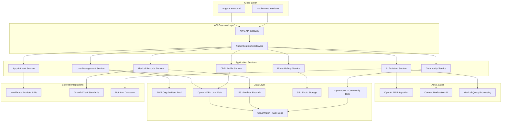
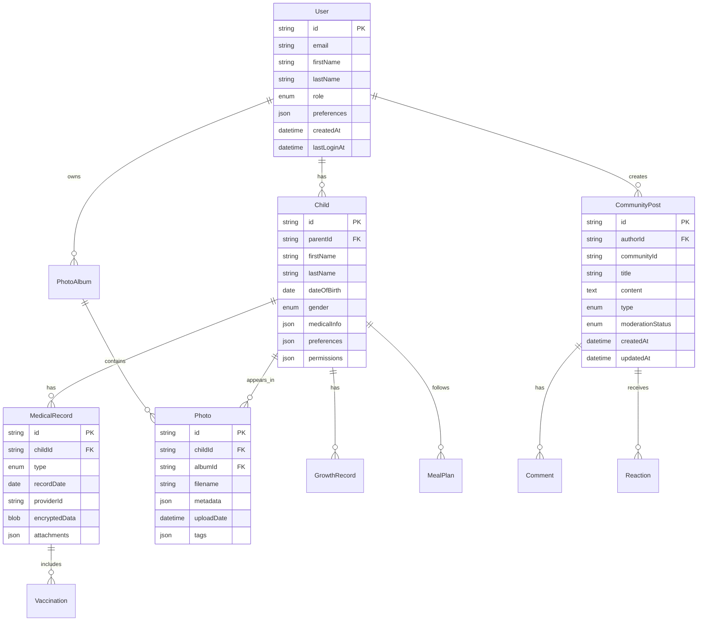

# Design Document: Famlink

## Overview

Famlink is a comprehensive Angular-based web application that serves as a centralized platform for parents to manage their children's care, connect with other parents, and receive AI-powered assistance. The system integrates multiple domains including healthcare management, social networking, and artificial intelligence to create a unified parenting experience.

The application leverages existing AWS Cognito authentication infrastructure and extends it with HIPAA-compliant data storage, AI chatbot integration, and a moderated community platform. The design prioritizes data security, user privacy (especially for children's data under COPPA), and seamless user experience across devices.

## Architecture

### High-Level Architecture



### Security Architecture

The system implements a multi-layered security approach:

1. **Authentication Layer**: AWS Cognito handles user authentication with MFA support
2. **Authorization Layer**: Role-based access control (RBAC) with fine-grained permissions
3. **Data Encryption**: All data encrypted at rest (AES-256) and in transit (TLS 1.3)
4. **HIPAA Compliance**: Business Associate Agreement (BAA) with AWS, audit logging, and PHI protection
5. **COPPA Compliance**: Special handling for children's data with parental consent mechanisms

## Components and Interfaces

### Core Components

#### 1. User Management Component
- **Purpose**: Handle user registration, authentication, and profile management
- **Key Methods**:
  - `registerUser(userData: UserRegistration): Promise<User>`
  - `authenticateUser(credentials: LoginCredentials): Promise<AuthToken>`
  - `updateUserProfile(userId: string, updates: UserUpdate): Promise<User>`
  - `managePermissions(userId: string, permissions: Permission[]): Promise<void>`

#### 2. Child Profile Component
- **Purpose**: Manage child profiles and associated data
- **Key Methods**:
  - `createChildProfile(parentId: string, childData: ChildProfile): Promise<Child>`
  - `updateChildProfile(childId: string, updates: ChildUpdate): Promise<Child>`
  - `getChildrenByParent(parentId: string): Promise<Child[]>`
  - `shareChildProfile(childId: string, recipientId: string, permissions: Permission[]): Promise<void>`

#### 3. Medical Records Component
- **Purpose**: Secure storage and management of medical information
- **Key Methods**:
  - `uploadMedicalRecord(childId: string, record: MedicalRecord): Promise<string>`
  - `getMedicalHistory(childId: string): Promise<MedicalRecord[]>`
  - `updateVaccination(childId: string, vaccination: VaccinationRecord): Promise<void>`
  - `generateGrowthChart(childId: string): Promise<GrowthChart>`
  - `shareMedicalData(childId: string, providerId: string): Promise<ShareToken>`

#### 4. AI Assistant Component
- **Purpose**: Natural language processing and task automation
- **Key Methods**:
  - `processQuery(userId: string, query: string): Promise<AIResponse>`
  - `executeAction(userId: string, action: AIAction): Promise<ActionResult>`
  - `generateMealPlan(childId: string, preferences: DietaryPreferences): Promise<MealPlan>`
  - `bookAppointment(childId: string, appointmentRequest: AppointmentRequest): Promise<AppointmentConfirmation>`

#### 5. Community Platform Component
- **Purpose**: Social networking features with moderation
- **Key Methods**:
  - `createPost(userId: string, post: CommunityPost): Promise<Post>`
  - `moderateContent(postId: string, moderatorId: string, action: ModerationAction): Promise<void>`
  - `joinCommunity(userId: string, communityId: string): Promise<void>`
  - `reportContent(userId: string, contentId: string, reason: string): Promise<void>`

#### 6. Photo Gallery Component
- **Purpose**: Cloud-based photo storage and organization
- **Key Methods**:
  - `uploadPhoto(childId: string, photo: PhotoUpload): Promise<Photo>`
  - `createAlbum(childId: string, albumData: Album): Promise<Album>`
  - `shareAlbum(albumId: string, recipientId: string): Promise<ShareLink>`
  - `organizePhotos(childId: string, organizationCriteria: PhotoCriteria): Promise<Album[]>`

### Interface Definitions

#### Core Data Interfaces

```typescript
interface User {
  id: string;
  email: string;
  firstName: string;
  lastName: string;
  role: UserRole;
  createdAt: Date;
  lastLoginAt: Date;
  preferences: UserPreferences;
}

interface Child {
  id: string;
  parentId: string;
  firstName: string;
  lastName: string;
  dateOfBirth: Date;
  gender: Gender;
  medicalInfo: MedicalInfo;
  preferences: ChildPreferences;
  permissions: ChildPermissions[];
}

interface MedicalRecord {
  id: string;
  childId: string;
  type: MedicalRecordType;
  date: Date;
  providerId: string;
  data: EncryptedMedicalData;
  attachments: string[];
}

interface AIResponse {
  id: string;
  query: string;
  response: string;
  actions: AIAction[];
  confidence: number;
  requiresConfirmation: boolean;
}

interface CommunityPost {
  id: string;
  authorId: string;
  communityId: string;
  title: string;
  content: string;
  type: PostType;
  moderationStatus: ModerationStatus;
  createdAt: Date;
  updatedAt: Date;
}
```

## Data Models

### User Data Model
- **Primary Key**: userId (UUID)
- **Attributes**: email, firstName, lastName, role, preferences, createdAt, lastLoginAt
- **Relationships**: One-to-many with Child profiles, Community posts, Photo albums
- **Security**: PII encrypted, audit logged

### Child Profile Data Model
- **Primary Key**: childId (UUID)
- **Attributes**: parentId, firstName, lastName, dateOfBirth, gender, medicalInfo, preferences
- **Relationships**: Many-to-one with User (parent), One-to-many with Medical records, Photos
- **Security**: COPPA compliant, parental consent required, encrypted storage

### Medical Records Data Model
- **Primary Key**: recordId (UUID)
- **Attributes**: childId, type, date, providerId, encryptedData, attachments
- **Storage**: AWS S3 with server-side encryption (SSE-KMS)
- **Security**: HIPAA compliant, access logged, retention policies applied

### Community Data Model
- **Primary Key**: postId (UUID)
- **Attributes**: authorId, communityId, title, content, type, moderationStatus, timestamps
- **Relationships**: Many-to-one with User, One-to-many with Comments, Reactions
- **Moderation**: AI pre-screening, human review queue, community reporting

### AI Conversation Data Model
- **Primary Key**: conversationId (UUID)
- **Attributes**: userId, messages, context, actions, timestamps
- **Storage**: DynamoDB with TTL for privacy
- **Security**: Conversation data encrypted, PHI redacted before AI processing

### Photo Gallery Data Model
- **Primary Key**: photoId (UUID)
- **Attributes**: childId, albumId, filename, metadata, uploadDate, tags
- **Storage**: AWS S3 with CloudFront CDN
- **Security**: Access controlled by child permissions, encrypted storage

### Database Schema Design



## Correctness Properties

*A property is a characteristic or behavior that should hold true across all valid executions of a system—essentially, a formal statement about what the system should do. Properties serve as the bridge between human-readable specifications and machine-verifiable correctness guarantees.*

Based on the prework analysis and property reflection, the following properties validate the core behaviors of the Famlink system:

### Property 1: User Authentication Round Trip
*For any* valid user registration data, creating an account and then authenticating with the same credentials should result in successful login and proper access to authorized features.
**Validates: Requirements 1.1, 1.2**

### Property 2: Child Profile Data Integrity
*For any* parent account and valid child profile data, creating a child profile should result in the data being stored correctly and retrievable with all original information intact.
**Validates: Requirements 2.1, 2.2**

### Property 3: Medical Record Secure Storage
*For any* valid medical document and child profile, uploading the document should result in secure cloud storage associated with the correct child, with the document being retrievable by authorized users only.
**Validates: Requirements 3.1, 3.5**

### Property 4: Medical History Preservation
*For any* medical information update, the system should preserve historical records while displaying current information, maintaining a complete audit trail.
**Validates: Requirements 3.3**

### Property 5: AI Assistant Profile Creation
*For any* valid child profile request made through natural language conversation, the AI Assistant should guide the user through profile creation and successfully create the profile with all required information.
**Validates: Requirements 6.2**

### Property 6: AI Action Confirmation
*For any* sensitive operation requested through the AI Assistant, the system should require explicit parent confirmation before executing the action.
**Validates: Requirements 6.6**

### Property 7: Photo Storage and Organization
*For any* valid photo upload and child profile, the photo should be stored securely in cloud storage, associated with the correct child, and organized according to the specified album structure.
**Validates: Requirements 7.1, 7.2**

### Property 8: Photo Deletion Safety
*For any* photo deletion request, the system should move the photo to a temporary trash folder before permanent deletion, allowing recovery within the retention period.
**Validates: Requirements 7.5**

### Property 9: Meal Plan Age Appropriateness
*For any* child profile and meal plan request, the generated meal plan should contain only age-appropriate foods and portions based on the child's age and any specified dietary restrictions.
**Validates: Requirements 8.1, 8.3, 8.5**

### Property 10: Growth Chart Accuracy
*For any* valid growth measurements entered for a child, the system should update growth charts correctly and provide accurate percentile comparisons based on standard growth references.
**Validates: Requirements 9.1**

### Property 11: Emergency Contact Priority
*For any* emergency information access request, the system should display emergency contacts in the correct priority order as specified by the parent.
**Validates: Requirements 10.3**

### Property 12: Multi-Child Data Separation
*For any* parent account with multiple children, the system should maintain separate data and privacy settings for each child while allowing unified management through a single parent account.
**Validates: Requirements 11.5**

### Property 13: Permission-Based Access Control
*For any* extended family member with granted permissions, the system should display only the information they are authorized to see, based on their specific permission level for each child.
**Validates: Requirements 12.3**

### Property 14: Permission Management Flexibility
*For any* permission change request from a parent, the system should immediately update access levels for extended family members and apply the changes to all relevant content and features.
**Validates: Requirements 12.4**

### Property 15: Content Moderation Workflow
*For any* reported inappropriate content, the system should flag it for moderator review and maintain the content in a review queue until a moderation decision is made.
**Validates: Requirements 13.1**

### Property 16: Data Encryption Consistency
*For any* personal or medical data stored or transmitted by the system, the data should be encrypted using appropriate encryption standards both at rest and in transit.
**Validates: Requirements 14.1, 14.2**

### Property 17: Account Deletion Data Removal
*For any* parent account deletion request, the system should securely remove all associated data within the specified timeframe while maintaining audit logs for compliance.
**Validates: Requirements 14.4**

### Property 18: Cross-Device Functionality Consistency
*For any* system feature accessed from different device types (mobile, tablet, desktop), the core functionality should remain consistent while adapting the interface appropriately for each device.
**Validates: Requirements 15.3**

### Property 19: Offline Critical Information Access
*For any* request to access critical information (emergency contacts, medical alerts) while offline, the system should provide the information from local cache without requiring network connectivity.
**Validates: Requirements 15.5**

## Error Handling

### Error Categories and Responses

#### 1. Authentication Errors
- **Invalid Credentials**: Return standardized error message without revealing whether email exists
- **Session Expiry**: Automatically redirect to login with session restoration after re-authentication
- **MFA Failures**: Provide clear guidance for MFA setup and troubleshooting

#### 2. Data Validation Errors
- **Invalid Child Profile Data**: Provide specific field-level validation messages
- **Medical Record Format Errors**: Support multiple file formats with clear format requirements
- **Photo Upload Errors**: Handle file size limits, format restrictions, and storage quotas

#### 3. AI Assistant Errors
- **Query Processing Failures**: Gracefully degrade to manual options when AI is unavailable
- **Action Execution Errors**: Provide clear error messages and alternative completion methods
- **Confirmation Timeout**: Automatically cancel sensitive operations if confirmation not received

#### 4. Integration Errors
- **Healthcare Provider API Failures**: Cache provider information and provide manual booking options
- **External Service Outages**: Implement circuit breakers and fallback mechanisms
- **Network Connectivity Issues**: Enable offline mode for critical functions

#### 5. Security and Privacy Errors
- **Unauthorized Access Attempts**: Log security events and implement progressive access restrictions
- **Data Encryption Failures**: Fail securely by preventing data storage/transmission
- **HIPAA/COPPA Compliance Violations**: Implement automated compliance checking with manual review

### Error Recovery Strategies

#### Graceful Degradation
- Core functionality remains available even when advanced features fail
- AI Assistant failures fall back to manual form-based interactions
- Community features continue working even if moderation AI is unavailable

#### Data Consistency
- Implement distributed transaction patterns for multi-service operations
- Use event sourcing for critical data changes to enable recovery
- Maintain data integrity during partial system failures

#### User Experience
- Provide clear, actionable error messages in plain language
- Offer alternative completion paths when primary methods fail
- Maintain user context and progress during error recovery

## Testing Strategy

### Dual Testing Approach

The Famlink system requires comprehensive testing using both unit tests and property-based tests to ensure correctness and reliability:

**Unit Tests**: Focus on specific examples, edge cases, and error conditions including:
- Authentication flows with various credential combinations
- Child profile creation with boundary conditions (age limits, data validation)
- Medical record encryption and access control scenarios
- AI Assistant response handling for specific query types
- Community moderation workflows with different content types
- Photo upload and organization with various file formats and sizes

**Property-Based Tests**: Verify universal properties across all inputs including:
- All 19 correctness properties defined above
- Data integrity across all CRUD operations
- Security and privacy compliance across all data handling
- Cross-device functionality consistency
- Error handling and recovery mechanisms

### Property-Based Testing Configuration

**Testing Framework**: Use **fast-check** for TypeScript/Angular property-based testing
- Minimum 100 iterations per property test to ensure comprehensive input coverage
- Each property test must reference its corresponding design document property
- Tag format: **Feature: famlink, Property {number}: {property_text}**

**Test Data Generation**:
- Generate realistic user profiles, child data, and medical records
- Create diverse community content for moderation testing
- Simulate various device types and network conditions
- Generate edge cases for age calculations, date handling, and file processing

**Integration Testing**:
- Test AI Assistant integration with OpenAI API using mock responses
- Verify AWS Cognito authentication flows with test user pools
- Test S3 storage operations with test buckets and encryption
- Validate HIPAA compliance with synthetic medical data

### Testing Priorities

1. **Security and Privacy**: Highest priority for all data handling and access control
2. **AI Assistant Functionality**: Critical for user experience and system differentiation
3. **Medical Data Management**: Essential for HIPAA compliance and user trust
4. **Community Platform**: Important for user engagement and safety
5. **Photo Management**: Valuable for user experience and data organization

### Continuous Testing

- Automated property-based tests run on every code commit
- Integration tests execute on staging environment deployments
- Security and compliance tests run daily with synthetic data
- Performance tests validate system behavior under load
- User acceptance testing with real families in controlled environments